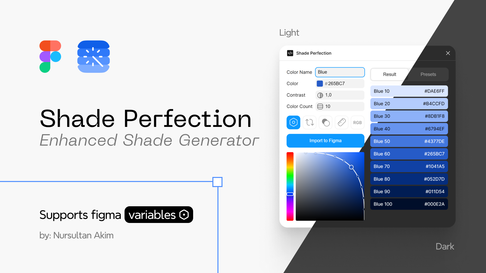
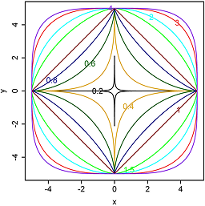
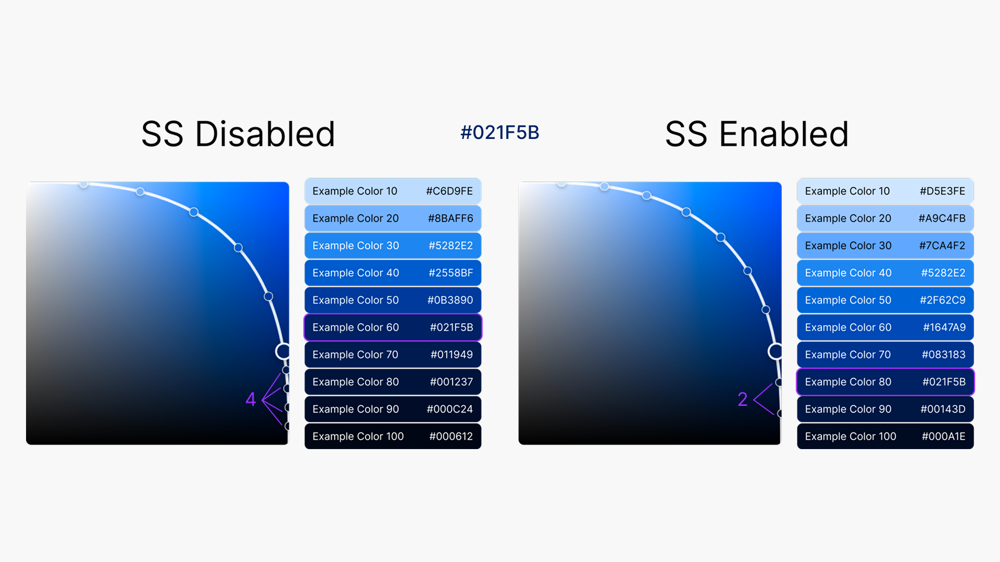
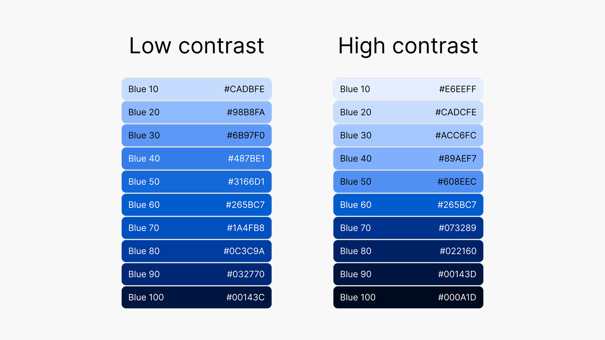

# Shade Perfection

A Figma plugin that generates perfectly balanced color palettes for design systems. 
Uses superellipse curves to create natural color progressions with mathematical precision.

**[Try it on Figma Community](https://www.figma.com/community/plugin/1525180972449816271/shade-perfection)**

[](https://github.com/ninsent/shade-perfection) [](LICENSE) [](https://www.figma.com/community/plugin/1525180972449816271/shade-perfection) 

## Features

- **Natural Distribution** — Uses superellipse curves `((x/a)^n + (y/b)^n = 1)` for perfect color distribution
- **Smart Spacing** — Proportional color distribution based on selected color position
- **Contrast Control** — Power distribution for custom contrast levels
- **Black & White** — Optional pure black and white endpoints
- **Figma Variables** — Import as native Figma color variables with automatic binding
- **10 Presets** — Beautiful pre-configured color palettes
- **HEX/RGB** — Switch between color formats
- **Reverse Order** — Flip palette from dark to light or light to dark
- **Saturation** — Smooth palettes for neutral colors such as `cool gray` or `warm gray`

---

## Mathematical Foundation

#### What is a Superellipse?

A superellipse is defined by the equation:

$$(x/a)^n + (y/b)^n = 1$$

Where `n` controls the curve's shape:
- `n = 1` → Diamond shape
- `n = 2` → Perfect circle
- `n > 2` → Rounded rectangle
- `n → ∞` → Square



#### Why Superellipse for Colors?

Traditional linear color interpolation creates unbalanced palettes. Superellipse curves:

1. **Find optimal curve** — Algorithm finds `n` value that passes through your selected color
2. **Arc-length distribution** — Colors distributed evenly along the curve's arc length
3. **Natural progression** — Creates perceptually balanced lightness/saturation transitions


---

## Installation

### For Users

1. Open Figma
2. Go to **Plugins** → **Browse plugins in Community**
3. Search for **"Shade Perfection"**
4. Click **Open in...**

### For Developers

1. Clone the project:
```bash
git clone https://github.com/ninsent/shade-perfection.git
```

2. Go to the project directory

```bash
cd shade-perfection
```

3. Install dependencies:
```bash
npm install
```

4. Build the plugin:
```bash
npm run build
```
The plugin uses **Vite** to bundle the UI. All source files are in `src/`, build output goes to `dist/`.

5. Test in Figma:
   - Open Figma Desktop
   - Go to Plugins → Development → Import plugin from manifest
   - Select `manifest.json` from the project directory

---

## Usage Guide

### Basic Workflow

1. **Choose a color** 
   - Use the color picker or enter HEX/RGB value
   - The superellipse curve updates in real-time

2. **Adjust settings**
   - **Color Count** (1-50): Number of shades to generate
   - **Contrast** (0.1-5.0): Distribution curve intensity
     - `< 1.0` = More colors in midtones
     - `= 1.0` = Even distribution
     - `> 1.0` = More colors in extremes

3. **Enable features**
   - **Import with Variables**: Creates Figma color variables with automatic frame binding
   - **Reverse Order**: Flips palette direction
   - **Include Black & White**: Adds pure endpoints
   - **Smart Spacing**: Proportional distribution based on color position
   - **RGB Format**: Toggle HEX to RGB display

4. **Name your palette**
   - Enter a color name (e.g., "Ocean Blue")
   - Generated shades will be named: "Ocean Blue 10", "Ocean Blue 20", etc.

5. **Import to Figma**
   - Click **"Import to Figma"**
   - Colors appear as frames

### Figma Variables

When "Import with Variables" is enabled:

- Creates Figma color variables in "Global" collection
- Generated frames automatically bind to their corresponding variables
- Re-importing palettes with identical names updates variables without breaking design connections
- Variables are named: `PaletteName/10`, `PaletteName/20`, etc.
- Black/White colors create `Neutral/Black` and `Neutral/White` variables

---

## Distribution Algorithms

The plugin uses two different distribution algorithms for two features that control how colors are placed along the superellipse curve.

### Smart Spacing



When enabled, distributes colors proportionally based on the selected color's position on the curve:

```javascript
// Selected color at 70% arc length:
// Standard:      [5 color tints] [SELECTED COLOR] [5 color shades]
// Smart Spacing: [7 color tints] [SELECTED COLOR] [3 color shades]
```

**Use when:**
- Selected color is very light or dark
- Need balanced palette with extreme colors
- Creating accessible color systems

### Contrast Control



Power function controls distribution density:

```javascript
// Linear (contrast = 1.0):
arcLength = (i / total) * selectedArc

// Curved (contrast ≠ 1.0):
powered = normalizedDistance^(1/1.5)
arcLength = selectedArc * powered
```

**Use when:**
- `contrast < 1.0` — More colors in midtones, subtle gradients
- `contrast = 1.0` — Even distribution
- `contrast > 1.0` — More colors in extremes, high contrast

### Why They're Incompatible

Smart Spacing and Contrast cannot be used together because both of them fundamentally change the distribution mathematics in different ways:

- **Smart Spacing** adjusts the ratio of colors before/after the selected color based on its position
- **Contrast** modifies the spacing density using power distribution

Both algorithms replace the standard linear distribution. When Smart Spacing is enabled, Contrast is automatically set to 1.0 (linear)

---

## Configuration

### Constants

```javascript
const CONFIG = {
      // Canvas dimensions
      PALETTE_SIZE: 180,
      HUE_SLIDER_SIZE: 180,

      // Curve calculation
      CURVE_RESOLUTION: 400,
      SUPERELLIPSE_N_MIN: 0.1,
      SUPERELLIPSE_N_MAX: 25,
      SUPERELLIPSE_TOLERANCE: 0.001,
      SUPERELLIPSE_MAX_ITERATIONS: 100,

      // Input constraints
      CONTRAST_MIN: 0.1,
      CONTRAST_MAX: 5.0,
      CONTRAST_STEP: 0.1,
      COLOR_COUNT_MIN: 1,
      COLOR_COUNT_MAX: 50,

      // Saturation control
      SATURATION_MIN: 0,
      SATURATION_MAX: 100,
      SATURATION_DEFAULT: 100,
      SATURATION_MIN_THRESHOLD: 1,

      // UI interactions
      DRAG_SENSITIVITY: 0.3,
      TOOLTIP_DELAY: 1000,
      ERROR_TOOLTIP_DELAY: 500,
      TAB_TRANSITION_DELAY: 150,

      // Visual styles
      CURVE_STROKE_WIDTH: 2,
      CURVE_PRIMARY_OPACITY: 0.9,
      CURVE_SECONDARY_OPACITY: 0.4,
      POINT_SECONDARY_OPACITY: 0.85,
    };
```

### Adding New Presets

```javascript
const PRESET_DATA = {
  'Your-Preset': {
    name: 'Your Preset Name',
    color: '#HEX_VALUE',
    contrast: 1.0,  // 0.1-5.0
    saturation: 100 //0%-100%
  }
};
```

---

## Contributing

Contributions are welcome! Please read our [Contributing Guide](CONTRIBUTING.md) for details on our code of conduct and the process for submitting pull requests.

---

## Resources

### Learn More

- [Superellipse on Wikipedia](https://en.wikipedia.org/wiki/Superellipse)
- [Color Theory Basics](https://www.interaction-design.org/literature/topics/color-theory)
- [Figma Plugin API](https://www.figma.com/plugin-docs/)

#### Social Network
- [Reddit post about this plugin](https://www.reddit.com/r/FigmaDesign/comments/1mxccki/i_created_plugin_that_generates_mathematically/)

---

## Changelog

### [1.2.1] - 2025-10-16

- Changed: Internal codebase refactoring with Vite build system and modular architecture

Check the [CHANGELOG.md](CHANGELOG.md) for a detailed history of changes.

---

## Author

**Nursultan Akim**

- Portfolio: [bento.me/ninsent](https://bento.me/ninsent)
- Figma Community: [@ninsent](https://figma.com/@ninsent)

---

## Support

- Report Bug: [GitHub Issues](https://github.com/ninsent/shade-perfection/issues)
- Request Feature: [GitHub Issues](https://github.com/ninsent/shade-perfection/issues)
- Contact: akim.off.nur@gmail.com

---

Made with ❤️ for the design community